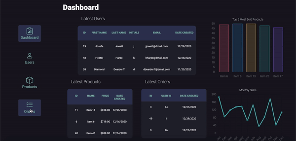

# Dashboard App

## About

This is dashboard app that diplays data for a company in regards to their operations i.e. Users, Orders and Products which it fetches from a local file, then parses and manipulates the data to be rendered in a clean, organised and useful manner. The app initially loads at the main dashboard which displays general info to give the user an overview of trends of the company by using charts that display the 5 most sold products and sales data for the past year, as well as 5 of the lastest users, orders and products.

### Live Site URL

You can access the live site at this address -

    https://dashboard-app-grnation.netlify.app/

## Usage

To run this application locally, download all the source files and make sure you have the "data.txt" file in your local directory. The application makes a fetch request to read data from this file before parsing it and converting to JSON.
